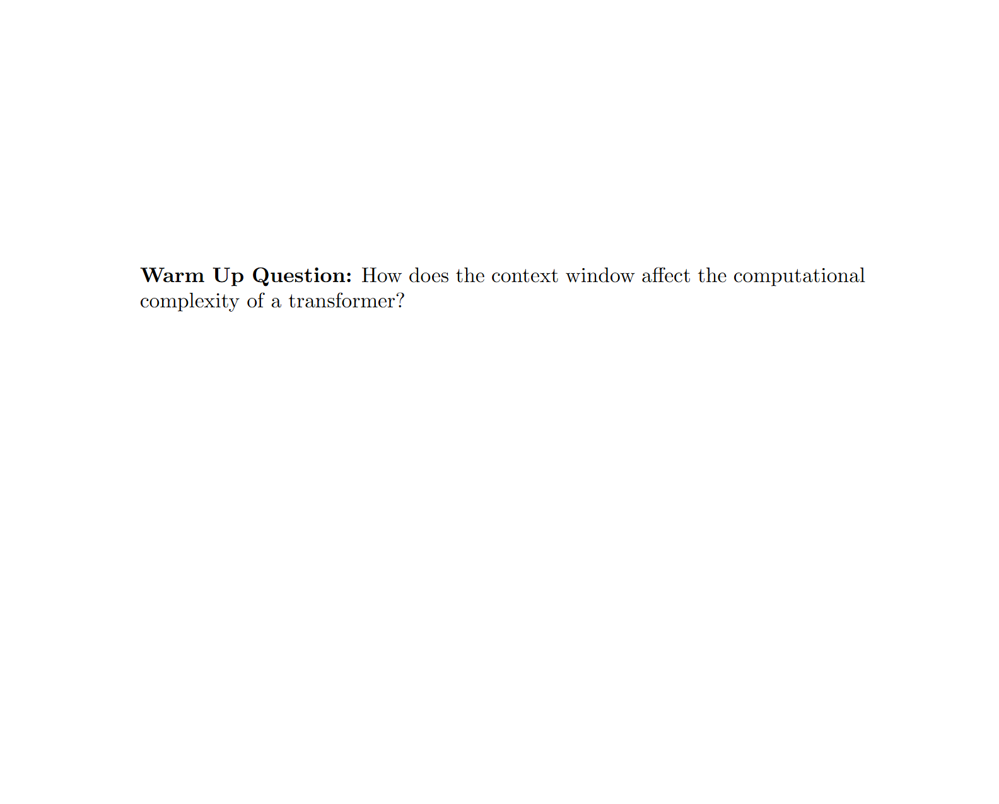
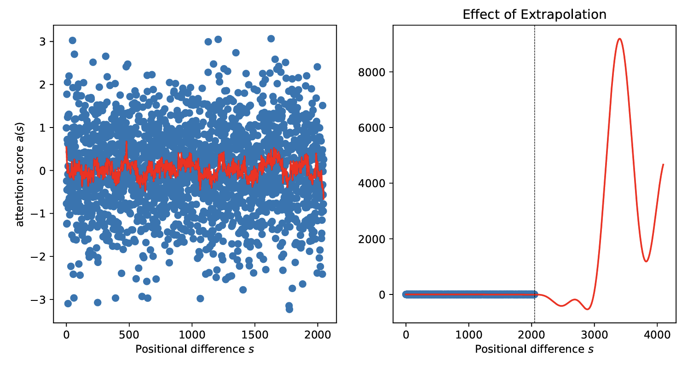
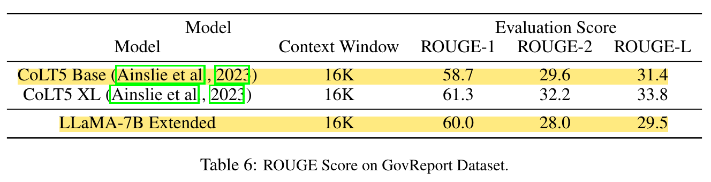

# A Review of "Extending Content Window of Large Language Models via Positional Interpolation"
Link to paper: [Extending Content Window of Large Language Models via Positional Interpolation](https://arxiv.org/abs/2306.15595) by Shouyuan Chen, Sherman Wong, Liangjian Chen, and Yuandong Tian.

**Citation.**
S. Chen, S. Wong, L. Chen, and Y. Tian, “Extending context window of
large language models via positional interpolation,” 2023.

---

<p align="center">

</p>


# Overview

**One of the major bottlenecks of the transformer architecture is the context window**. Generally speaking, the model is limited to the context size that it is trained on. Trying to use the model beyond its context window length results in a significant performance drop. This is a problem because the computational complexity of training the large language model is a function of the context size, $O(n^2 \cdot d)$, where $n$ is the context window length. To summarize, large language models struggle to perform on tasks that are beyond the scope of their context window, but increasing the context window causes quadratic growth in the computational demand of training the model.

This leads us to the problem statement: **can we extend the context window of an existing pre-trained LLM?**

This problem statement is a direct target of the concerns outlined above. First, it concerns itself with effectively increasing the context window length without performance degredation. Second, it neglects the quadratic increase in computational cost of training by leveraging pre-trained LLMs.

Naively, we could try fine-tuning an existing pre-trained transformer with a longer context window. Empirically, however, the authors found that models trained this way adapt to long context windows very slowly. Later on, we will discuss the authors' results using fine-tuning in which training this way for long periods of time (>10000 batches) resulted in only an effective context window length increase from 2048 $\rightarrow$ 2560, whereas Position Interpolation could do it up to 32768 in less than 1000 batches.

To answer these demands, the authors introduce **Position Interpolation** (PI). Position Interpolation linearly down-scales the input position indices to match the original context window size, rather than extrapolating beyond the trained context length, which may lead to catastrophically high attention scores that completely ruin the self-attention mechanism.

# Background

### Positional Embeddings
**What are positional embeddings? Why do we care?**

Positional embeddings encode information about the ordering of tokens in a sequence. It is easy to see how significantly the meaning of a sentence can change when changing only the ordering of the words. For example, let's look at the phrase "Samuel Sasaki is a fan of LeBron James". By manipulating the ordering of the words, one possible outcome is "Lebron James is a fan of Samuel Sasaki", which, as much as I might want it to be, is just not true.

### Rotary Position Embeddings (RoPE)
Rotary position embeddings represent positional information by rotating the token embedding based on its position in the sequence. This rotation is applied in the complex plane and is parameterized by the position index, allowing the model to encode positional differences more naturally. One of the key benefits of RoPE at its introduction was its ability to encode relative and absolute positions between tokens in a sequence.

<p align="center">

</p>

_Citation: Sambit Kumar Barik. Decoding Rotary Positional Embeddings (RoPE): The Secret Sauce for Smarter Transformers._ [Link](https://medium.com/@DataDry/decoding-rotary-positional-embeddings-rope-the-secret-sauce-for-smarter-transformers-193cbc01e4ed).

Because RoPE is parameterized by the position of the token in the sequence, then the rotation applied on the token is unique, thereby resulting in an embedding that contains information about its content and its position.

However, RoPE, like many other positional encoding techniques, is susceptible to failing when used for inference on a context window length beyond what was used in training.

<p align="center">

</p>


# Position Interpolation
Before jumping into the details of the method, let's first introduce an intuition for it. The image below provides a visualization of how Position Interpolation affects the positional embeddings of a sequence.
<p align="center">

</p>

The top graph shows the method of extrapolation in which the positional encoding mechanism goes beyond the context window and tries to generate positional embeddings beyond what it has done in training. The bottom graph showcases Positional Interpolation. We see that PI squishes the original position embeddings for the original context window to make room for the new positional embeddings computed on the new context window length. This way, the model is handling positional embeddings that it has seen before and we limit the growth of the indices that parameterize RoPE.

Next, Positional Interpolation will be explained mathematically. Consider the following formula for computing a positional embedding using RoPE:

<p align="center">

</p>

where $x$ is the token embedding and $m$ is the assigned index based on position in the sequence.

To apply Positional Interpolation to RoPE, all that needs to be done is a linear scaling of the index $m$ by a factor of $\frac{L}{L^\prime}$ such that $L, L^\prime$ are the original context window length and new context window length, respectively.

<p align="center">

</p>

We are lucky enough to be able to see what the code changes look like because LLaMA is an open-source model and the developer community provided a detailed discussion on the ideation and implementation of this method.

```diff
diff --git a/examples/main/main.cpp b/examples/main/main.cpp 
@@ -12172,7 +12172,7 @@ static void ggml_compute_forward_rope_f32(
                 if (ir++ < ir0) continue;
                 if (ir   > ir1) break;
 
-                float theta = (float)p;
+                float theta = (float)p*0.5;
 
                 if (!is_neox) {
                     for (int64_t i0 = 0; i0 < ne0; i0 += 2) {
@@ -12285,7 +12285,7 @@ static void ggml_compute_forward_rope_f16(
                 if (ir++ < ir0) continue;
                 if (ir   > ir1) break;
 
-                float theta = (float)p;
+                float theta = (float)p*0.5;
 
                 if (!is_neox) {
                     for (int64_t i0 = 0; i0 < ne0; i0 += 2) {
@@ -12423,7 +12423,7 @@ static void ggml_compute_forward_rope_back_f32(
                 if (ir++ < ir0) continue;
                 if (ir   > ir1) break;
 
-                float theta = (float)p;
+                float theta = (float)p*0.5;
 
                 if (!is_neox) {
                     for (int64_t i0 = 0; i0 < ne0; i0 += 2) {
@@ -12536,7 +12536,7 @@ static void ggml_compute_forward_rope_back_f16(
                 if (ir++ < ir0) continue;
                 if (ir   > ir1) break;
 
-                float theta = (float)p;
+                float theta = (float)p*0.5;
 
                 if (!is_neox) {
                     for (int64_t i0 = 0; i0 < ne0; i0 += 2) {
```

It is an amazingly simple idea that is so powerful.

# Experiments
With their experiments, the authors demonstrate that PI can be used to extend the effective context window length 32x its original length using less than 1000 training steps. The models augmented with PI are tested on tasks such as language modeling, passkey retrieval, and long document summarization.

### Model Variants
The authors extended the pre-trained 7B, 13B, 33B and 65B LLaMA models to various context window of sizes up to 32768, using either direct fine-tuning or Position Interpolation method. 

### Datasets
For evaluating the PI-augmented models' perplexity in long-context tasks, the authors used the **PG-19** and **Arxiv Proof Pile** datasets. These two datasets contain a corpus of books and scientific documents, respectively. The authors also wanted to examine the effective context window size of the finetuned models. To do so, the authors generate prompts containing a large amount of text and a passkey. The passkey is planted at some point in the text and it is the job of the model to be able to retrieve it with some amount of consistency. If the model is able to do so when the passkey is $k$ tokens away from when it is prompted to retrieve it, then it is said to have an effective context window length of $k$. Finally, the authors examine the models' ability to summarize long documents. The authors use the **GovReport** dataset, which contains 17457 documents for training and 972 documents for evaluation. 

# Results

<p align="center">

</p>

<p align="center">

</p>

<p align="center">

</p>

<p align="center">

</p>

<p align="center">

</p>

# Critical Analysis

### Applicability to Other Models
One of the glaring oversights of the paper is that it primarily evaluates PI on LLaMA models, which uses RoPE. However, many popular models (like GPT-4, etc.) use different positional encodings. It's unclear how effective the proposed method would be for extending context window length in models that use other positional encoding techniques.

### Lack of Robustness Testing
The paper focuses on tasks like long document summarization and passkey retrieval but doesn’t cover more complex or noisy scenarios, such as handling code, mixed content, or languages with irregular structures. Tests on noisy data or multilingual settings could reveal hidden vulnerabilities.

### Missing Analysis on Cost of Fine-Tuning using PI
The authors communicate the efficiency of their method using only the number of training steps needed to achieve results. However, this is a pretty abstract result and does not provide a lot of clarity into the true cost of applying PI to a LLaMA model.

In reality, the authors used from 32 up to 128 A100 GPUs. While the authors note that this is not a requirement for using their method, they do not provide any insight into how much of a barrier not having this kind of compute is for using Positional Interpolation.

# Impacts
This work has huge implications for the future of AI. The authors show a computationally efficient way to drastically extend the context window size of transformers, namely the open-source LLaMA. The work itself is additionally open-source. To summarize, the authors have provided an efficient, open-source implementation for a state-of-the-art algorithm for extending the context window size for the LLaMA model. This has largely made available the technology to solve challenging problems such as conducting long conversations, summarizing long documents, or executing long-term planning, which were previously only achievable by large, well-funded institutions due to the computational complexity of training transformers.

### 1. Democratization of Long-Context Transformers
A major impact of the this work is that it is primarily focused (and implemented) on variations of LLaMA, which is an open-source model. This means that anybody with an internet connection can, within reason, implement Position Interpolation on their own and have access to a performant long-context model. Historically, long-context models were limited to major research institutions and corporations due to the computational cost of training transformers with large context windows. This method allows smaller organizations and independent researchers to work with transformers in long-context tasks, effectively decentralizing this capability.

### 2. Redefining the Possibilities with Transformers
By providing a more accessible way to acquire a large language model with significantly longer context window, industries such as health care, legal, and research become domains to which transformers can be applied. Previously, the limits of context window and the computational cost of training a model with a longer context window made it much more challenging for inventive LLM solutions to problems in these industries; of which there are many. For example, models can now process and summarize entire patient histories or legal documents without being constrained by short context windows. This has the potential to streamline operations in domains that require analysis of extended, detailed information.

# Recap
<p align="center">

</p>

<p align="center">

</p>


## Resources to directly help understand Position Interpolation better
1. https://github.com/ggerganov/llama.cpp/discussions/1965 - official discussion by Meta engineers/researchers
2. https://kaiokendev.github.io/til#extending-context-to-8k - initial proof of concept
3. https://kaiokendev.github.io/context - a longer write up of (2)
4. https://www.youtube.com/watch?v=oyXdmtHgZFw&ab_channel=GabrielMongaras - a helpful paper review
5. https://www.reddit.com/r/LocalLLaMA/comments/14fgjqj/a_simple_way_to_extending_context_to_8k/ - Reddit discussion on the topic

## Background, motivation, and related works of Position Interpolation
1. https://arxiv.org/abs/2104.09864 - RoPE paper
2. https://www.llama.com/ - LLaMA
