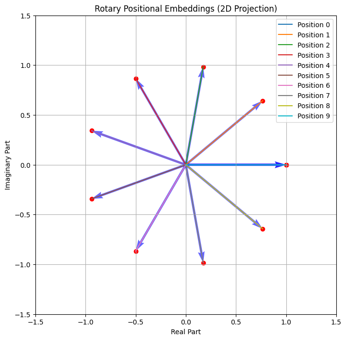
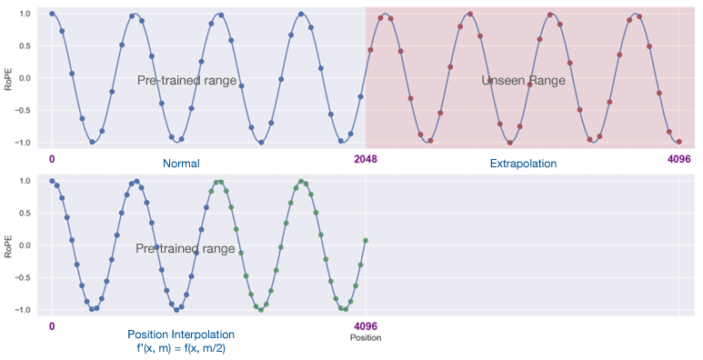
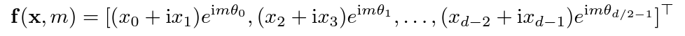
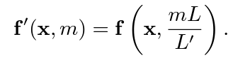
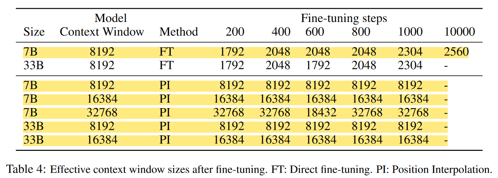
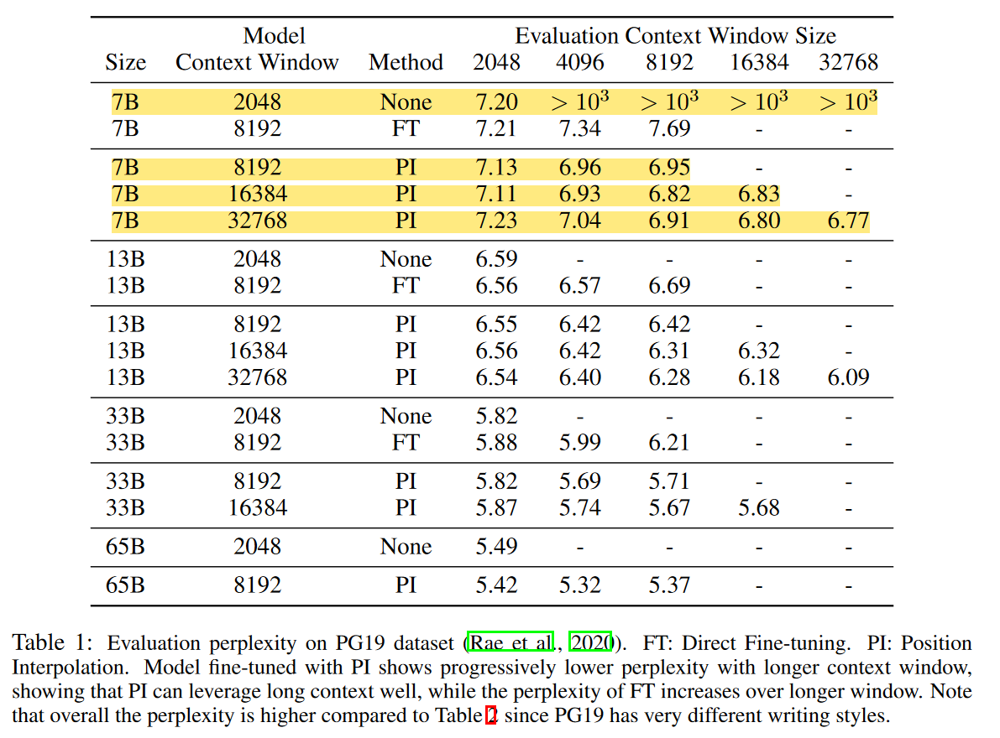
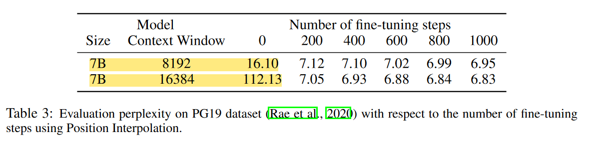
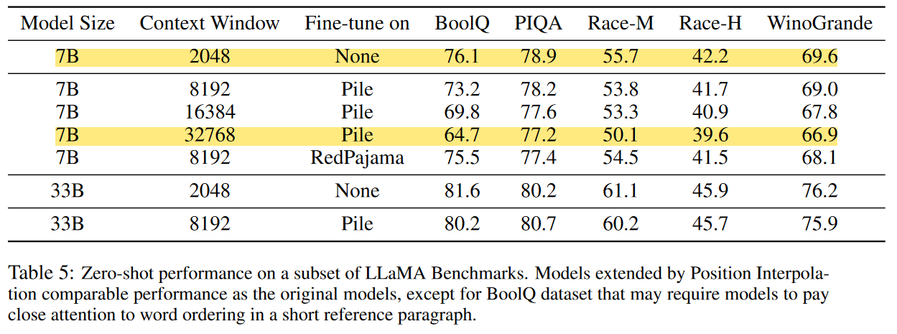

# A Review of Extending Content Window of Large Language Models via Positional Interpolation
Link to paper: [Extending Content Window of Large Language Models via Positional Interpolation](https://arxiv.org/abs/2306.15595) by Shouyuan Chen, Sherman Wong, Liangjian Chen, and Yuandong Tian.

**Citation.**
S. Chen, S. Wong, L. Chen, and Y. Tian, “Extending context window of
large language models via positional interpolation,” 2023.

# Rubric
- [x] [2] Technical
- [x] [5] Presentation (15 minutes or less)
- [x] [10] Presentation Materials (README format + screen clear enough)
- [ ] [15] Overview (5-minute overview providing context, stating problem, characterizing approach, brief account of how problem was addressed)
- [x] [8] Question 1 (prepare and deliver a question to the audience)
- [ ] [5] Question 2 (prepare and deliver a question to the audience)
- [ ] [15] Architecture overview (pseudocode description of model or approach)
- [x] [15] Critical Analysis (what was overlooked? what could have been developed further? were there any errors?)
- [x] [15] Impacts (what was the impact of the work?)\
- [x] [5] Resource links
- [ ] [10] Code demonstration
- [x] [5] Repo
- [x] [2] Citation

Maximum possible points: 112

---

# Overview

One of major limitations of large language models (LLMs) is the context window. Generally speaking, the model is limited to the context size that it is trained on. Trying to use the model beyond its context window length results in a significant performance drop. This is a problem because the computational complexity of training the large language model is a function of the context size, $O(n^2 \cdot d)$, where $n$ is the context window length. To summarize, large language models struggle to perform on tasks that are beyond the scope of their context window, but increasing the context window causes quadratic growth in the computational demand of training the model.

This leads us to the problem statement: **can we extend the context window of an existing pre-trained LLM?**

This problem statement is a direct target of the concerns outlined above. First, it concerns itself with effectively increasing the context window length without performance degredation. Second, it neglects the quadratic increase in computational cost of training by leveraging pre-trained LLMs.

Naively, we could try fine-tuning an existing pre-trained Transformer with a lnoger context window. Empirically, however, the authors found that models trained this way adapt to long context windows very slowly. Table 4 shows that training this way for long periods of time (> 10000 batches) resulted in only an effective context window length increase from 2048 -> 2560, whereas PI could do it up to 32768 in less than 1000 batches.

To answer these demands, the authors introduce **Position Interpolation** (PI). Position Interpolation linearly down-scales the input position indices to match the original context window size, rather than extrapolating beyond the trained context length, which may lead to catastrophically high attention scores that completely ruin the self-attention mechanism.

**Q:** What happens if we extrapolate too far?

# Background

### Positional Embeddings
**What are positional embeddings? Why do we care?**

Positional embeddings encode information about the ordering of tokens in a sequence. It is easy to see how significantly the meaning of a sentence can change when changing only the ordering of the words. For example, let's look at the phrase "Samuel Sasaki is a fan of LeBron James". By manipulating the ordering of the words, one possible outcome is "Lebron James is a fan of Samuel Sasaki", which, as much as I might want it to be, is just not true.

### Rotary Position Embeddings (RoPE)
Rotary position embeddings represent positional information by rotating the token embedding based on its position in the sequence. This rotation is applied in the complex plane and is parameterized by the position index, allowing the model to encode positional differences more naturally. One of the key benefits of RoPE at its introduction was its ability to encode relative and absolute positions between tokens in a sequence.

_Citation: Sambit Kumar Barik. Decoding Rotary Positional Embeddings (RoPE): The Secret Sauce for Smarter Transformers._ [Link](https://medium.com/@DataDry/decoding-rotary-positional-embeddings-rope-the-secret-sauce-for-smarter-transformers-193cbc01e4ed).

Because RoPE is parameterized by the position of the token in the sequence, then the rotation applied on the token is unique, thereby resulting in an embedding that contains information about its content and its position.

# Position Interpolation
Before jumping into the details of the method, let's first introduce an intuition for it. The image below provides a visualization of how Position Interpolation affects the positional embeddings of a sequence.

# Experiments

# Results

# Critical Analysis

One of the glaring oversights of the paper is that it primarily evaluates PI on LLaMA models, which uses RoPE. However, many popular models (like GPT-4, etc.) use different positional encodings. It's unclear how effective the proposed method would be for extending context window length in models that use other positional encoding techniques.

# Impacts
This work has huge implications for the future of AI. The authors show a computationally efficient way to drastically extend the context window size of transformers, namely the open-source LLaMA. The work itself is additionally open-source. To summarize, the authors have provided an efficient, open-source implementation for a state-of-the-art algorithm for extending the context window size for the LLaMA model. This has largely made available the technology to solve challenging problems such as conducting long conversations, summarizing long documents, or executing long-term planning, which were previously only achievable by large, well-funded institutions due to the computational complexity of training transformers.

### 1. Democratization of Long-Context Transformers
A major impact of the this work is that it is primarily focused (and implemented) on variations of LLaMA, which is an open-source model. This means that anybody with an internet connection can, within reason, implement Position Interpolation on their own and have access to a performant long-context model. Historically, long-context models were limited to major research institutions and corporations due to the computational cost of training transformers with large context windows. This method allows smaller organizations and independent researchers to work with transformers in long-context tasks, effectively decentralizing this capability.

### 2. Redefining the Possibilities with Transformers
By providing a more accessible way to acquire a large language model with significantly longer context window, industries such as health care, legal, and research become domains to which transformers can be applied. Previously, the limits of context window and the computational cost of training a model with a longer context window made it much more challenging for inventive LLM solutions to problems in these industries; of which there are many. For example, models can now process and summarize entire patient histories or legal documents without being constrained by short context windows. This has the potential to streamline operations in domains that require analysis of extended, detailed information.

# Resources to directly help understand Position Interpolation better
1. https://github.com/ggerganov/llama.cpp/discussions/1965 - official discussion by Meta engineers/researchers.
2. https://kaiokendev.github.io/til#extending-context-to-8k - initial proof of concept
3. https://kaiokendev.github.io/context - a longer write up of (2)
4. https://www.youtube.com/watch?v=oyXdmtHgZFw&ab_channel=GabrielMongaras - a helpful paper review

# Background, motivation, and related works of Position Interpolation
1. https://arxiv.org/abs/2104.09864 - RoPE paper
2. https://www.llama.com/ - LLaMA
3. https://arxiv.org/abs/2108.12409 - ALiBi
4. https://arxiv.org/abs/2212.10554 - LeX

# Notes

The extrapolation problem for transformers is trying to use context windows that are larger than the context window used for training.

Computational complexity of transformers is O(n^2 * d), where n is the sequence length and d is the dimensionality of the embeddings. This heavily limits the size of the context window that we can use when doing heavy training. Therefore, being able to fine-tune (which is much more computationally efficient) and achieve better results with a larger context window, is a really significant result.

- [ ] What is perplexity? Make sure I talk about how perplexity relates to this method. How is it affected?

Figure 2 is bad. The graph on the far right that represents the stability of the method uses a significantly smaller scale of positional difference.

Interesting story with the paper being proposed concurrently by someone else and such...

# Citations

